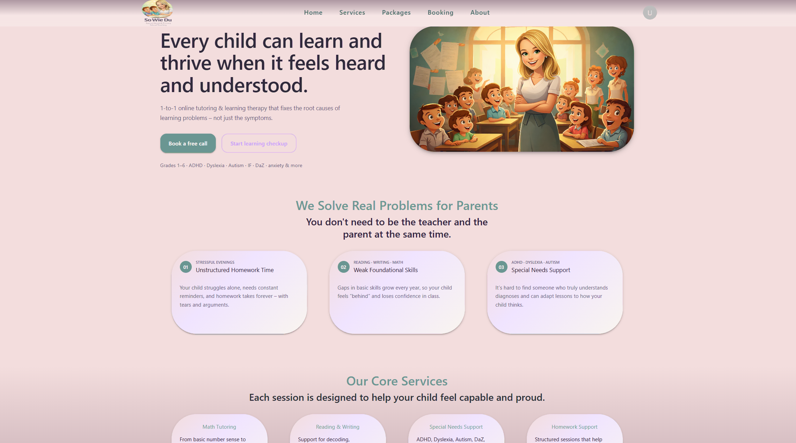
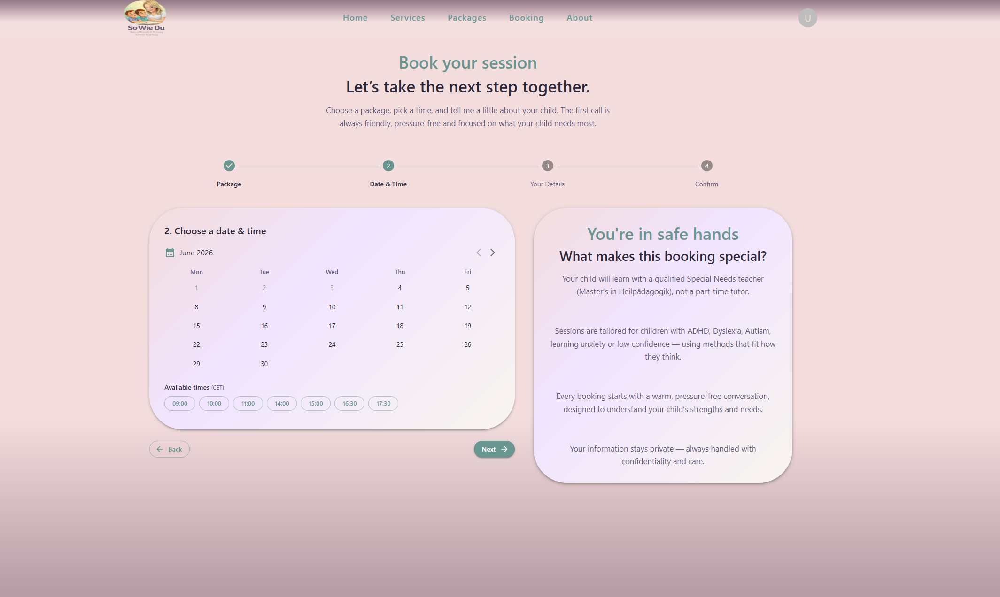
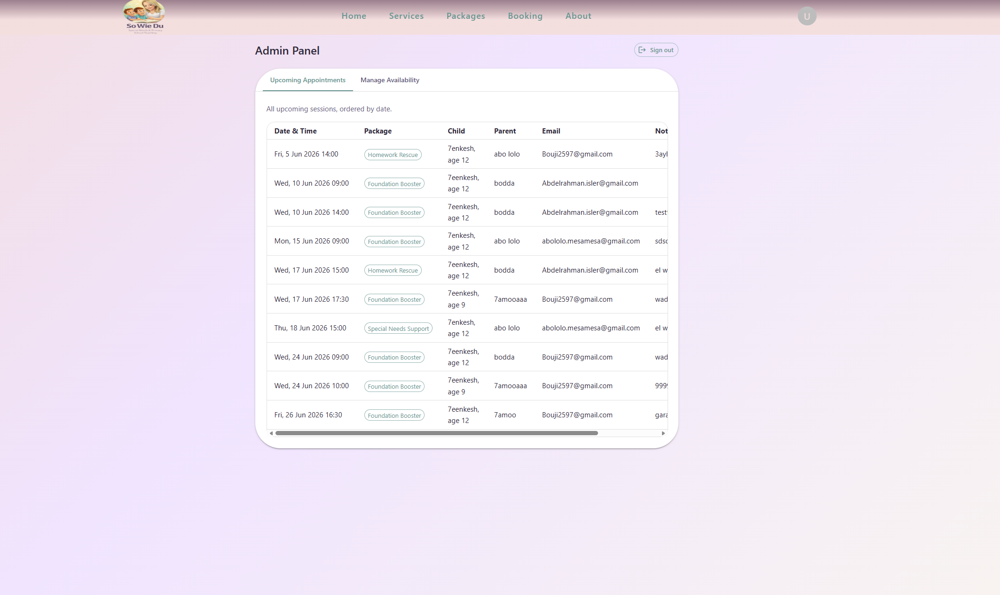
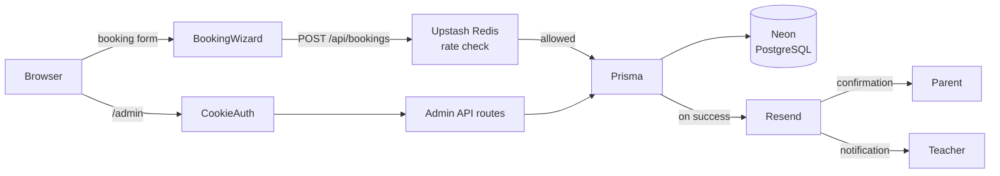

# 🍎 Primary Teacher — Booking Platform

A full-stack service website for a special-needs tutoring practice. Parents browse packages, pick a session time in a guided 4-step wizard, and receive an instant email confirmation. The teacher manages all appointments and availability through a password-protected admin panel.

**Live demo → [primary-teacher.vercel.app](https://primary-teacher.vercel.app)**

---

## Screenshots

| Homepage | Booking Wizard | Admin Panel |
|---|---|---|
|  |  |  |

---

## Features

- **4-step booking wizard** — package selection, calendar, time slot, contact details
- **Conflict detection** — server-side check prevents double-bookings
- **Rate limiting** — sliding-window guard (5 req / 10 min per IP) via Upstash Redis
- **Email notifications** — booking confirmation to parent + alert to teacher via Resend
- **Admin panel** — view appointments, block unavailable dates, password-protected session
- **HTTP security headers** — `X-Frame-Options`, `X-Content-Type-Options`, HSTS in production

---

## Tech Stack

| Layer | Technology |
|---|---|
| Framework | Next.js 16 (App Router) |
| Language | TypeScript (strict mode) |
| UI | Material UI 7 + Emotion |
| Validation | Zod |
| ORM | Prisma 6 |
| Database | PostgreSQL (Neon) |
| Email | Resend |
| Rate limiting | Upstash Redis |
| Package manager | pnpm |

---

## Architecture



---

## Local Setup

### Prerequisites

- Node.js 20+
- pnpm 9+ (`npm i -g pnpm`)
- A PostgreSQL database — see [Database Setup](#database-setup)

### Install

```bash
pnpm install
```

### Configure environment

```bash
cp .env.example .env
```

Fill in all values — see [Environment Variables](#environment-variables) below.

### Apply database migrations

```bash
pnpm prisma migrate deploy
```

### Start dev server

```bash
pnpm dev
```

Open [http://localhost:3000](http://localhost:3000).

---

## Environment Variables

Copy `.env.example` to `.env` and fill in the following:

| Variable | Description |
|---|---|
| `DATABASE_URL` | Pooled PostgreSQL connection string (use Neon's pooled URL) |
| `DIRECT_URL` | Direct PostgreSQL connection string (used by Prisma migrations only) |
| `RESEND_API_KEY` | API key from [resend.com](https://resend.com) |
| `TEACHER_EMAIL` | Email address that receives new booking alerts |
| `FROM_EMAIL` | Verified sender address in Resend (use `onboarding@resend.dev` for testing) |
| `ADMIN_PASSWORD` | Password for the `/admin` panel |
| `ADMIN_SECRET` | Long random string used to sign the admin session cookie |
| `UPSTASH_REDIS_REST_URL` | REST URL from [console.upstash.com](https://console.upstash.com) — optional in dev |
| `UPSTASH_REDIS_REST_TOKEN` | Token from Upstash — optional in dev, rate limiting is skipped if absent |

---

## Database Setup

This project uses **PostgreSQL**. The recommended free host is [Neon](https://neon.tech):

1. Create a free project at [neon.tech](https://neon.tech)
2. Copy the **pooled** connection string → `DATABASE_URL`
3. Copy the **direct** connection string → `DIRECT_URL`
4. Run `pnpm prisma migrate deploy`

---

## Admin Access

The admin panel is at `/admin`, protected by the `ADMIN_PASSWORD` environment variable.

Once logged in you can:
- View all upcoming and past appointments
- Block specific dates or time ranges
- See parent contact details for each booking

---

## Project Structure

```
app/
  api/
    bookings/       # POST — public booking endpoint (rate limited)
    admin/          # Admin-only routes (auth guarded)
  admin/            # Admin panel pages
  booking/          # 4-step booking wizard
  packages/         # Packages page
  services/         # Services page
  about/            # About page
src/
  Components/       # Reusable UI components
  lib/              # Prisma client, Resend, Zod schemas, rate limiter
  theme.ts          # MUI theme
prisma/
  schema.prisma     # Appointment and BlockedSlot models
  migrations/       # SQL migration history
```
